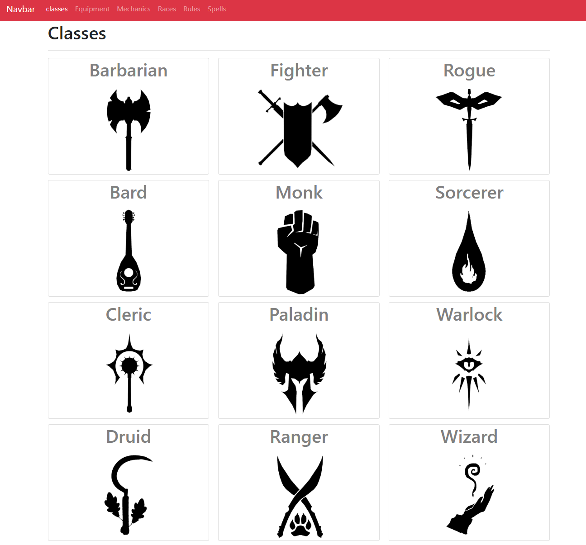

<p align="center">
  <a href="" rel="noopener">
</p>

<h3 align="center">dnd-compendium</h3>

<div align="center">

[]()
[](https://github.com/kylelobo/The-Documentation-Compendium/issues)
[](https://github.com/kylelobo/The-Documentation-Compendium/pulls)
[](/LICENSE)

</div>

---

<p align="center"> Few lines describing your project.
    <br> 
</p>

## 📝 Table of Contents

- [About](#about)
- [Getting Started](#getting_started)
- [Deployment](#deployment)
- [Usage](#usage)
- [Built Using](#built_using)
- [TODO](../TODO.md)
- [Contributing](../CONTRIBUTING.md)
- [Authors](#authors)
- [Acknowledgments](#acknowledgement)

## 🧐 About <a name = "about"></a>

You have a full world to discover and a dungeon to finish, but do you have all the adventurer information? Perfect, come and discover it with dnd-compendium. Feel free to browse the different tabs and discover all that Forgotten Realms has to teach you

[]()

## 🏁 Getting Started <a name = "getting_started"></a>

You can download

```
git clone https://github.com/mattseidel/dnd-compendium
```

or just on visit the [live version](https://dnd-compendium.vercel.app/)

### Prerequisites

```
node = 12.16.2 or later
```

you cant find it [here](https://nodejs.org/es/download/)

### Installing

once you have downloaded the source code, and you have installed node you can use the following command to install the dependencies

```
npm install

```

at the end of the installation you can use the following command to start the service

```
npm start
```

this displays the application and opens the default browser at the site [localhost:3000](http://localhost:3000)

## 🔧 Running the tests <a name = "tests"></a>

Test not added yet to the code

### Break down into end to end tests

Explain what these tests test and why

```
Give an example
```

### And coding style tests

Explain what these tests test and why

```
Give an example
```

## 🎈 Usage <a name="usage"></a>

In the current development version it is only possible to see the information of the basic dnd classes, in future versions you will be able to see the different tabs that the navbar brings

## 🚀 Deployment <a name = "deployment"></a>

Add additional notes about how to deploy this on a live system.

## ⛏️ Built Using <a name = "built_using"></a>

- [React](https://reactjs.org) - Framework

## ✍️ Authors <a name = "authors"></a>

- [@MattSeidel](https://github.com/Mattseidel) - Idea & Initial work

See also the list of [contributors](http://www.dnd5eapi.co/) who participated in this project.

## 🎉 Acknowledgements <a name = "acknowledgement"></a>

thank you for reading